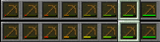

# ⛽ Fuel Settings

```yaml
example_car_fuel:
  General:
    Enable_Fuel: true
    Name: "Example Car Fuel"
    Amount_Fuel_Liters: 15.0
    Display_Amount_Fuel_On_Damage: true
    
  Item: <Item Serializer>
    Material: STONE_SHOVEL
    Name: "<!i>&cExample Car Fuel &8| &a%fuel_amount%L"
    Lore:
      - '<!i>&7Needed for refueling Example Car'
      - '<!i>&7Amount Fuel&8: &c%fuel_amount%&8/&a%fuel_max_amount%'
    Stackable: true
    Custom_Model_Data: 1
    Unbreakable: false
    Hide_Flags: true
```

## General

**Enable\_Fuel** - Defines if this fuel is enabled in the plugin

**Name** - Displayed fuel name in placeholders

**Amount\_Fuel\_Liters** - Maximum amount of fuel possible

**Display\_Amount\_Fuel\_On\_Damage** - Whether to display the amount of fuel in the item's durability bar

## Item

Fuel ItemStack settings. [item-serializer.md](serializers/item-serializer.md "mention")
