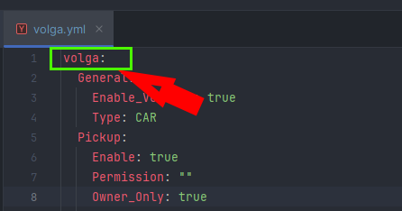

# 🛻 Vehicle Settings


New to the wiki? This page contains **important information** about config! Read this first!



## **Vehicle Title**

All vehicles have a unique "vehicle title" in config. It is the name at the top of the file, like:

<figure><figcaption></figcaption></figure>

In the image above, the vehicle title is "volga". To get the item in your server, use /rv give vehicles:volga


The names of files are completely ignored. We suggest matching them with your vehicle title (e.g., `volga.yml`), but this is optional and does not affect the plugin.



Your vehicle title (And ALL OTHER config options) should **never** use any character other then a->z, A->Z, 0->9, and underscores `_`. Do NOT use periods or dashes.


***

## Sections (Modules)

All vehicles use modules. A "Module" is a fancy way of saying a section in your config. For example, the **Movement** module is required for all weapons. It goes under your vehicle name in the config with 2 spaces. Let's look at an example of the `volga`:

```yaml
volga:
  Movement:
    # Other options go here, like Lock_Camera, Physics, Wheels and Events
```

Most modules can also have sections inside. For example:

```yaml
Movement:
  Lock_The_Camera:
    Enable: true
    # Other options go here, like Seats and Interpolation
```

Here is the complete list of modules (You can also see this on the sidebar on the left of this page!):

1. [General](general.md)
2. [Pickup](pickup.md)
3. [Place](place/)\
   1\. [Blocks](place/blocks.md)
4. [Lock](lock.md)
5. [Seat](seat/)\
   1\. [Enter vehicle](seat/enter-vehicle.md)\
   2\. [Leave vehicle](seat/leave-vehicle.md)\
   3\. [Change seat](seat/change-seat.md)
6. [Honk](honk.md)
7. [Health](health.md)
8. [Fuel](fuel.md)
9. [Trunk](trunk.md)
10. [Engine](engine.md)
11. [Parking brake](parking-brake.md)
12. [GearBox](gearbox.md)
13. [Steering](steering/)\
    1\. [Steering\_Wheel](steering/steering-wheel.md)\
    2\. [Pedals](steering/pedals.md)
14. [Movement](movement/)\
    1\. [Lock camera](movement/lock-camera.md)\
    2\. [Physics](movement/physics.md)\
    3\. [Wheels](movement/wheels.md)
15. [Components](components.md)\
    1\. Skins\
    2\. Seats\
    3\. Wheels\
    4\. Trunks\
    5\. Fuel\_Tanks
16. [Control](control.md)
17. [Models](models.md)
18. [Item](item.md)
